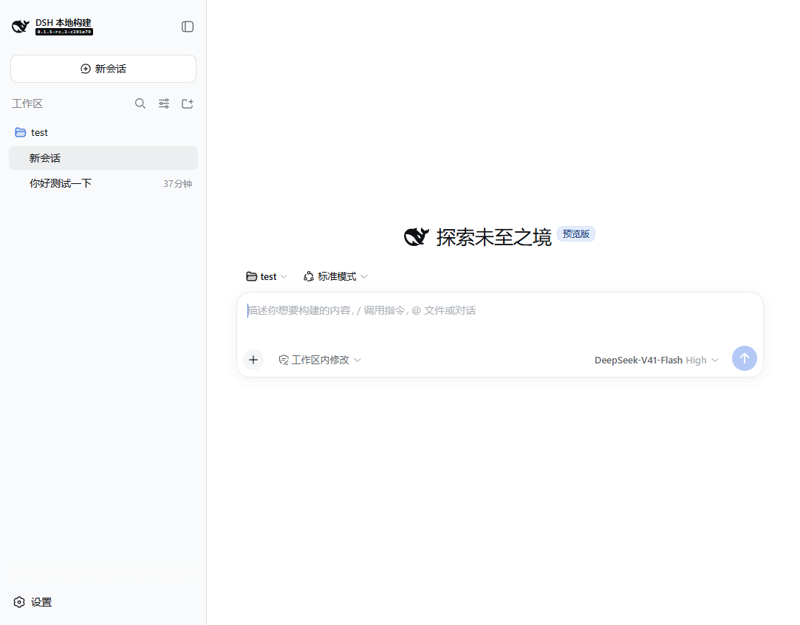
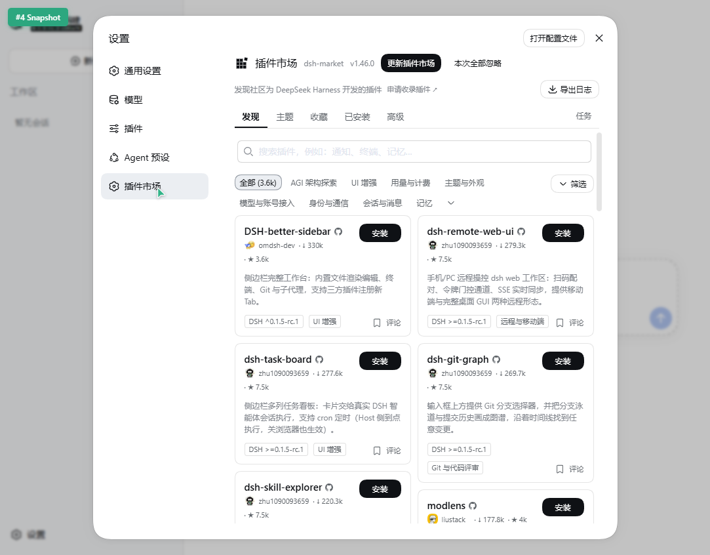

# 致谢与引用 Acknowledgements

## 界面截图 Screenshots

主界面（DSH Web）：

插件市场（dsh-market v1.46.0）：

## 引用来源 References

本项目基于以下公开资料构建，特此引用致谢：

| 来源 | 说明 | 链接 |
| --- | --- | --- |
| DeepSeek Harness | DeepSeek AI 开源的智能体运行框架（本仓库的上游源码） | https://github.com/deepseek-ai/deepseek-harness |
| DeepSeek Harness 官方文档 | 架构、开发与使用指南 | https://deepseek-harness.github.io/deepseek-harness/ |
| DeepSeek 官网 · Harness | 官方理念页 “Everything is a plugin” | https://deepseek.com/harness/en/ |
| Cordis | 插件内核，负责插件的挂载、卸载与依赖管理 | https://github.com/cordiverse/cordis |
| dsh-market | 社区插件市场插件（本机安装于 web profile） | https://github.com/dsh-market/dsh-market |
| 《A Programming Paradigm for Spatiotemporal Composability》 | 描述 Cordis 设计的论文 | https://arxiv.org/abs/2608.25512 |
| MIT License | 本项目采用的开源许可证 | https://opensource.org/license/mit |

## 致谢 Thanks

**一切皆插件（Everything is a Plugin）。**

感谢 **DeepSeek** 开源 DeepSeek Harness，把 Agent 的模型、工具、技能、会话、沙箱、存储、循环与界面全部拆成可组合、可替换的插件，让“Agent = Model + Harness”成为每一位开发者都能亲手把玩的现实。

感谢 **梁圣**，以及 DeepSeek Harness 团队对「一切皆插件」这一理念的坚持与践行——它让复杂的能力边界变得轻盈，让每一次扩展都无需触碰特权核心。

愿插件生态生生不息。
